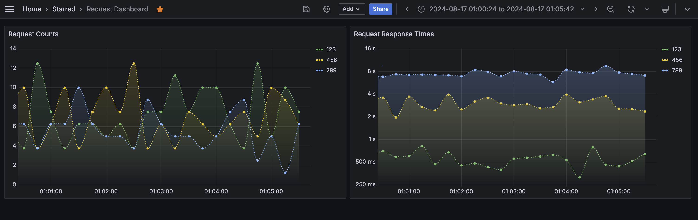

# Custom Prometheus Exporter for Grafana
Demo project to show how to create a custom Prometheus exporter for Grafana.



## How to run
Install Docker and Docker Compose, then run the following command:
```bash
docker compose build
docker compose up
```

## How to access
- Open Grafana in your browser: [http://localhost:3000](http://localhost:3000)
- Add new Prometheus data source with URL: `http://prometheus:9090`
- Import the dashboard from the file `grafana/dashboard.json`

